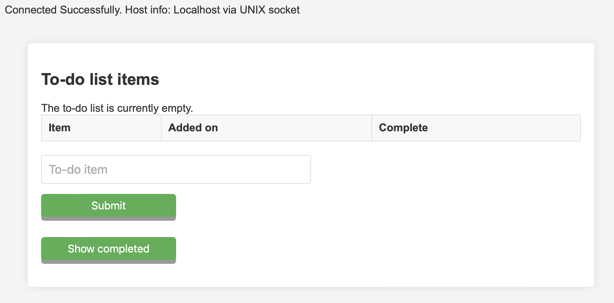
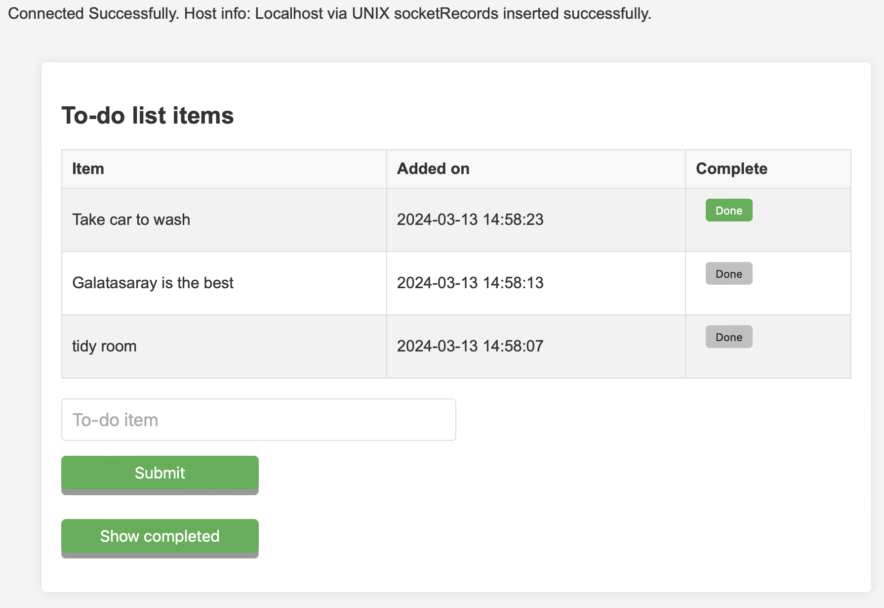
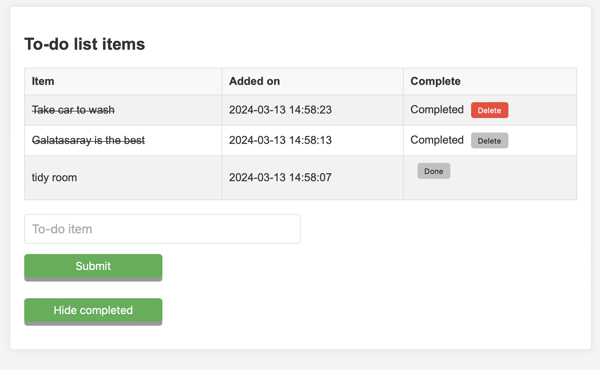

## Empty To Do list 


## Added To Do tasks


## Show completed tasks



# To Do List Application

## Description
This application is designed to help users manage their daily tasks efficiently. It allows users to add, mark as completed, and delete tasks from their to-do list. The application is user-friendly, with a clean and simple interface that ensures a smooth user experience. I added styling to the buttons, when the button 'Done' is hovered it will turn green and once clicked it will draw a line over the task and place it into 'show completed'. When the button 'Delete' is hovered over, it will display red and delete the to do task once it has been completed. The user can toggle between 'show completed' and 'hide completed' to see what tasks has been completed or tasks that still needs to be done.

## Table of Contents
- [Installation](#installation)
- [Usage](#usage)
- [Technologies Used](#technologies-used)
- [Credits](#credits)

## Installation
Clone the project repository by running the following command:
```bash
git clone https://github.com/M311HAN/To-do-List.git

# Navigate into the cloned directory
cd To-Do-List

```
## Usage

After cloning the repository:

1. Navigate to the project directory.
2. Open the todo.php file in your web browser.
3. To add a task, enter the task name in the input field and click on the "Submit" button.
4. To mark a task as completed, click on the "Done" button next to the task.
5. To delete a completed task, click on the "Delete" button next to the task.
6. You can toggle the visibility of completed tasks by clicking on the "Show completed" or "Hide completed" button.

## Technologies Used

• PHP
• MySQL
• HTML
• CSS
• JavaScript (for future enhancements)

## Credits

This project was created by Melihhan (https://github.com/M311HAN). For more details, questions, or feedback, reach out through GitHub.
